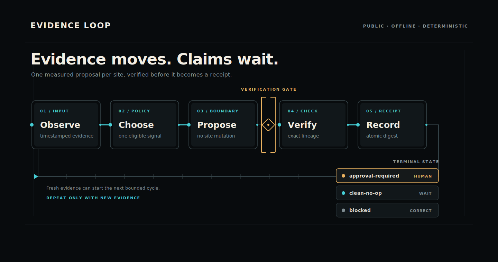

[](https://github.com/NavidBroumandfar/evidence-loop-visibility-engine/actions/workflows/ci.yml)

# Evidence Loop Visibility Engine

**Evidence before action.**

A deterministic, offline reference implementation for turning bounded
visibility evidence into one reviewable proposal per site.

Version `0.3.0` was controller-accepted
on 2026-07-20 after independent read-only `opencode-go/grok-4.5` (`high`)
evaluation returned PASS. Immutable candidate identities are recorded outside
the candidate tree so editing a truth document cannot invalidate a fingerprint
embedded in that same content. The `v0.3.0` GitHub release is the publication
trigger; PyPI availability follows its protected Trusted Publishing workflow.



## The 60-second explanation

The engine accepts strict, timestamped evidence packets, chooses one eligible
opportunity per site, and produces a proposal without changing the site. It
then verifies the proposal's lineage, routing, and approval boundary before it
records an atomic receipt.

Every run stops in an explicit state: `approval-required`, `clean-no-op`, or
`blocked`. Selection and receipts are deterministic, so the same exact input
bytes produce the same decision and digest. The installed runtime uses only
the Python standard library and makes no network, browser, provider, or
credential calls.

This is a control loop for reviewable decisions—not a black-box promise of
rankings, traffic, answer inclusion, citations, or causality.

## Who it is for

- Engineers building evidence-first SEO, AEO, GEO, or LLMO tooling.
- Technical SEO and editorial teams that need a reproducible proposal trail.
- Evaluators testing lineage, failure containment, and human approval gates.
- Operators who want a useful offline core before connecting any live system.

## Public core and private operation

This repository is a complete, useful offline core. It is not an intentionally
crippled demo, and its Apache-2.0 implementation has no artificial lock-in.
Real adapters, calibrated evidence and history, evaluation and operator
judgment, team workflows, and managed operation can add value around the core
without changing what the public package honestly does.

See the [open-core boundary](docs/open-core-boundary.md) for the extension
points, clean-room rule, and the line between public behavior and separately
operated systems.

## Quickstart

Python 3.10+ is required. Runtime dependencies are the Python standard
library only.

### Released PyPI package

```console
python3 -m venv .venv
.venv/bin/python -m pip install evidence-loop-visibility-engine
.venv/bin/evidence-loop demo --output work/demo
.venv/bin/evidence-loop benchmark
```

This invokes the currently published PyPI release. The source workflow below
exercises the same commands from a checkout.

### Run from source

From the root of the source working tree:

```console
python3 -m venv .venv
.venv/bin/python -m pip install -e .
.venv/bin/evidence-loop validate --input examples/normal.json
.venv/bin/evidence-loop normalize --input examples/connector-envelope.json --as-of 2026-12-31T00:00:00Z --output work/normalized
.venv/bin/evidence-loop validate --input work/normalized/normalized.json
.venv/bin/evidence-loop run --input examples/normal.json --output work/normal
.venv/bin/evidence-loop demo --output work/demo
.venv/bin/evidence-loop benchmark
```

The package artifact exposes the same `evidence-loop` command. The committed
`examples/` files are readable fixtures; packaged resources make `demo` and
`benchmark` work after wheel or source-distribution installation too.

`normalize` accepts one or more sanitized Connector Exchange Envelope v1
files and deterministically writes a schema-version-2 document. Schema
version `1` documents remain supported. The installed core performs no
network or provider calls, and normalization alone creates no opportunities.
Its `--as-of` UTC collection bound is required; it never falls back to the
wall clock.

For release artifact validation, install the optional build tools and run the
same gate:

```console
.venv/bin/pip install -e '.[release]'
.venv/bin/python scripts/artifact_smoke.py
```

## Optional Vercel connector

Vercel users may separately install the
[Evidence Loop Vercel Web Analytics Connector](https://github.com/NavidBroumandfar/evidence-loop-vercel-web-analytics-connector).
Its `v0.1.0` GitHub release emits sanitized envelope JSON for this core. It is
the optional second package; it is not bundled into the core, and it remains
separately unpublished on PyPI.

## Companion GitHub Action

Phase 3 adds a companion Action that accepts only sanitized
Connector Exchange Envelope v1 files, requires an explicit UTC `as-of`
bound, normalizes with the installed public core, and runs one bounded cycle.
It never invokes or bundles a provider connector. The fixed artifact contains
only `normalized.json`, `run.json`, and the non-blocked
`last-success.json`.

External Action dependencies are pinned to full commit SHAs, the core executes
directly from the immutable Action checkout without package installation, and the documented caller permission is
`contents: read`. Push and pull-request workflows completed the hosted Action
job successfully at candidate commit `bfa544e`, with `clean-no-op` and
`external_calls=0`. This does not prove publication, provider compatibility,
or a production result. See
the [companion Action guide](docs/github-action.md).

## One bounded cycle

**Observe -> Choose -> Propose -> Verify -> Record**

Choose is explicit: fresh, non-missing evidence is eligible; lower numeric
priority wins, then the stable opportunity ID breaks ties. Propose is the
runtime's Act step and never mutates a site. Verify is a distinct fail-closed
boundary before Record. See [LOOPS.md](LOOPS.md) and
[docs/loop-engineering.md](docs/loop-engineering.md).

## Input and output

An input document has reserved example URLs, evidence, and opportunities:

```json
{"schema_version":"1","sites":[{"site_id":"site-a","site":"https://a.example","evidence":[{"evidence_id":"ev-1","source_kind":"manual-observation","observed_at":"2026-01-15T10:00:00Z","completeness":"complete","freshness":"fresh","uncertainty":"low"}],"opportunities":[{"opportunity_id":"opp-1","domain":"technical-seo","title":"Review indexability signals","priority":1,"evidence_ids":["ev-1"],"approval_gate":"human-review"}]}]}
```

`run.json` preserves site, evidence IDs, source kind, timestamp,
completeness, freshness, uncertainty, routed capability, and approval gate:

```json
{"terminal_state":"approval-required","input_sha256":"<SHA-256 digest of exact input bytes>","sites":[{"site_id":"site-a","status":"approval-required","selected_opportunity_id":"opp-1","proposal":{"approval_required":true,"mutation_allowed":false,"evidence_ids":["ev-1"]}}],"safety":{"offline":true,"site_mutation":false,"provider_access":false}}
```

The CLI prints only safe counts, IDs, terminal state, and zero external calls
or cost. `last-success.json` is atomically replaced only for a non-blocked
run.

## Capability maturity

These are deterministic proposal templates, not SEO analysis or outcome
predictions:

| Allowlisted module | Maturity | Proposal boundary |
| --- | --- | --- |
| measurement-integrity | Implemented deterministic | Preserve source, window, completeness, freshness, uncertainty |
| technical-seo | Implemented deterministic | Propose an indexability/crawlability review |
| search-intent-content | Implemented deterministic | Propose an intent clarification review |
| aeo-answerability | Implemented deterministic | Propose a question/answer structure review |
| geo-citation-research | Synthetic observation | Observe a citation surface; never fabricate a GEO score |
| llmo-sampling | Synthetic observation | Specify fixed-prompt sampling, variance, terms, and cost gates |
| brand-governance | Approval-gated | Propose claim and voice consistency review |
| marketing-conversion | Approval-gated | Propose a measured conversion hypothesis review |

Unknown capability domains block their entire site lane. Other sites remain
isolated.

## Commands and exit codes

- `validate --input FILE`: strict validation; exit `0` when valid, `2` on a
  global input/path error.
- `normalize --input FILE [--input FILE ...] --as-of UTC --output DIR`:
  required explicit UTC-bound offline Connector Exchange Envelope v1
  validation and deterministic schema-version-2 output; exit `0` when valid,
  `2` on an input/output error.
- `run --input FILE --output DIR`: one bounded cycle; exit `0` for
  `approval-required` or `clean-no-op`, `3` for global `blocked`, and `2` for
  an input/output error.
- `demo --output DIR`: committed synthetic normal, clean-no-op, and contained
  failure examples; exit `0` when all complete.
- `benchmark`: deterministic public conformance cases and pass rate; exit `0`
  when all cases pass.

## Security and non-goals

The installed engine/CLI opens no network connection, invokes no browser or
provider, reads no credential environment, spawns no process, and mutates no
site. It rejects duplicate JSON keys, NaN/Infinity, oversized or deeply nested
input, unsafe IDs/timestamps/strings, lexical traversal, and symlink ancestors
or children. Output receipts are atomic. The release scanner is separate
defense-in-depth tooling and may invoke local Git to enumerate tracked files;
its heuristic is not proof of safety.

This is not an autonomous SEO, growth, ranking, traffic, answer, citation, or
conversion system. It does not claim special markup, `llms.txt`, or any file
guarantees Google or another system's visibility. It does not publish,
schedule, create backlinks, submit pages, or access private repositories.
Fixtures are synthetic and use reserved example domains.

## Documentation and development

- [Architecture](docs/architecture.md)
- [Loop engineering](docs/loop-engineering.md)
- [Open-core boundary](docs/open-core-boundary.md)
- [Connector contract](docs/connector-contract.md)
- [Optional Vercel connector](https://github.com/NavidBroumandfar/evidence-loop-vercel-web-analytics-connector)
- [Companion GitHub Action](docs/github-action.md)
- [Visibility domains](docs/visibility-domains.md)
- [Security model](docs/security.md)
- [Public claims](docs/public-claims.md)
- [Quickstart](docs/quickstart.md)
- [Release contract](docs/releasing.md)
- [Roadmap](ROADMAP.md)
- [CONTRIBUTING.md](CONTRIBUTING.md)

Run `make check` for tests, compilation, and the release scanner. Artifact
build/install smoke checks are in `scripts/artifact_smoke.py`.
