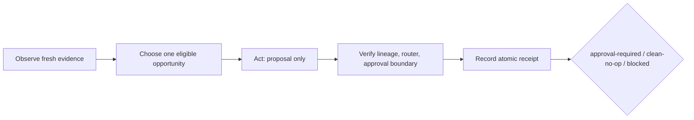

# Evidence Loop Visibility Engine

Evidence Loop Visibility Engine is a small Apache-2.0 reference implementation
for turning bounded, timestamped visibility evidence into one reviewable
proposal per site. It is useful to engineers, technical SEOs, editorial teams,
and evaluators who need a reproducible offline loop—not a black-box promise.

It implements **Observe -> Choose -> Act (proposal only) -> Verify -> Record**.
The terminal receipt is `approval-required`, `clean-no-op`, or `blocked`. The
engine is synthetic/offline by default, multi-site, deterministic, and
fail-closed. It does not edit sites, publish content, call providers, or infer
rankings, traffic, answers, citations, or causality.

## Quickstart

Python 3.10+ is required. Runtime dependencies are the Python standard
library only.

```console
python3 -m venv .venv
.venv/bin/python -m pip install -e .
.venv/bin/evidence-loop validate --input examples/normal.json
.venv/bin/evidence-loop run --input examples/normal.json --output work/normal
.venv/bin/evidence-loop demo --output work/demo
.venv/bin/evidence-loop benchmark
```

The package artifact exposes the same `evidence-loop` command. The committed
`examples/` files are readable fixtures; packaged resources make `demo` and
`benchmark` work after wheel or source-distribution installation too.

For release artifact validation, install the optional build tools and run the
same gate:

```console
.venv/bin/pip install -e '.[release]'
.venv/bin/python scripts/artifact_smoke.py
```

## One bounded cycle



Choose is explicit: fresh, non-missing evidence is eligible; lower numeric
priority wins, then the stable opportunity ID breaks ties. Act never mutates a
site. Verify is a distinct fail-closed boundary before Record. See
[LOOPS.md](LOOPS.md) and [docs/loop-engineering.md](docs/loop-engineering.md).

## Input and output

An input document has reserved example URLs, evidence, and opportunities:

```json
{"schema_version":"1","sites":[{"site_id":"site-a","site":"https://a.example","evidence":[{"evidence_id":"ev-1","source_kind":"manual-observation","observed_at":"2026-01-15T10:00:00Z","completeness":"complete","freshness":"fresh","uncertainty":"low"}],"opportunities":[{"opportunity_id":"opp-1","domain":"technical-seo","title":"Review indexability signals","priority":1,"evidence_ids":["ev-1"],"approval_gate":"human-review"}]}]}
```

`run.json` preserves site, evidence IDs, source kind, timestamp,
completeness, freshness, uncertainty, routed capability, and approval gate:

```json
{"terminal_state":"approval-required","input_sha256":"<SHA-256 digest of exact input bytes>","sites":[{"site_id":"site-a","status":"approval-required","selected_opportunity_id":"opp-1","proposal":{"approval_required":true,"mutation_allowed":false,"evidence_ids":["ev-1"]}}],"safety":{"offline":true,"site_mutation":false,"provider_access":false}}
```

The CLI prints only safe counts, IDs, terminal state, and zero external calls
or cost. `last-success.json` is atomically replaced only for a non-blocked
run.

## Capability maturity

These are deterministic proposal templates, not SEO analysis or outcome
predictions:

| Allowlisted module | Maturity | Proposal boundary |
| --- | --- | --- |
| measurement-integrity | Implemented deterministic | Preserve source, window, completeness, freshness, uncertainty |
| technical-seo | Implemented deterministic | Propose an indexability/crawlability review |
| search-intent-content | Implemented deterministic | Propose an intent clarification review |
| aeo-answerability | Implemented deterministic | Propose a question/answer structure review |
| geo-citation-research | Synthetic observation | Observe a citation surface; never fabricate a GEO score |
| llmo-sampling | Synthetic observation | Specify fixed-prompt sampling, variance, terms, and cost gates |
| brand-governance | Approval-gated | Propose claim and voice consistency review |
| marketing-conversion | Approval-gated | Propose a measured conversion hypothesis review |

Unknown capability domains block their entire site lane. Other sites remain
isolated.

## Commands and exit codes

- `validate --input FILE`: strict validation; exit `0` when valid, `2` on a
  global input/path error.
- `run --input FILE --output DIR`: one bounded cycle; exit `0` for
  `approval-required` or `clean-no-op`, `3` for global `blocked`, and `2` for
  an input/output error.
- `demo --output DIR`: committed synthetic normal, clean-no-op, and contained
  failure examples; exit `0` when all complete.
- `benchmark`: deterministic public conformance cases and pass rate; exit `0`
  when all cases pass.

## Security and non-goals

The installed engine/CLI opens no network connection, invokes no browser or
provider, reads no credential environment, spawns no process, and mutates no
site. It rejects duplicate JSON keys, NaN/Infinity, oversized or deeply nested
input, unsafe IDs/timestamps/strings, lexical traversal, and symlink ancestors
or children. Output receipts are atomic. The release scanner is separate
defense-in-depth tooling and may invoke local Git to enumerate tracked files;
its heuristic is not proof of safety.

This is not an autonomous SEO, growth, ranking, traffic, answer, citation, or
conversion system. It does not claim special markup, `llms.txt`, or any file
guarantees Google or another system's visibility. It does not publish,
schedule, create backlinks, submit pages, or access private repositories.
Fixtures are synthetic and use reserved example domains.

## Documentation and development

- [Architecture](docs/architecture.md)
- [Loop Engineering](docs/loop-engineering.md)
- [Visibility domains](docs/visibility-domains.md)
- [Security model](docs/security.md)
- [Public claims](docs/public-claims.md)
- [Quickstart](docs/quickstart.md)
- [CONTRIBUTING.md](CONTRIBUTING.md)

Run `make check` for tests, compilation, and the release scanner. Artifact
build/install smoke checks are in `scripts/artifact_smoke.py`.
